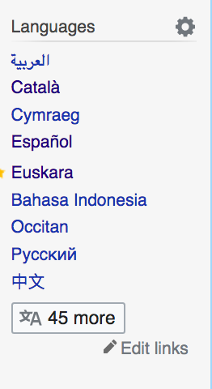
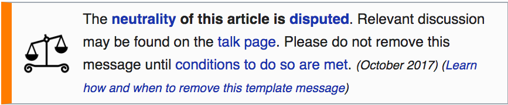

```{r setup, include=FALSE}
knitr::opts_chunk$set(echo = FALSE)
library(tidyverse)
library(here)
library(ggpmisc)
library(useful)

```

## Problem

- Wikipedia is a go-to source for information
- Edited by the comunity
- Consensus based
- This paper presents a methodology for critical analysis of wikipedia content

## About the Research

- Analyses performed using R and Rstudio (both open source)
- All source code and data available online: https://github.com/dietrichson/ila2019
  - Reproduce 
  - Replicate
  - Reuse

## Wikipedia API

- Wikipedia publishes an API (Application Programming Interface)
- Allows open access to content, including revisions in a machine readable format

```{r, eval=FALSE, echo=TRUE}
wp_c <- revision_content("en","wikipedia", revisions = 552373187)
```


## What is "a Lot"

- One of the ways to detect a controversial topic is that it has *a lot* of edits
- What is *a lot*?
- A baseline needs to be established
- Sample: 1000 random pages from each of: 
  - English
  - Spanish
  - Catalan
  - Portuguese
  - Galician (Galego)
  - Esperanto
  - French
  - Basque

```{r, include=FALSE}
myData <- 
    readRDS( here("data/sample_1000_contributions_ca.RDS") ) %>% 
    rbind(
      readRDS( here("data/sample_1000_contributions_en.RDS"))
    ) %>% 
    rbind(
      readRDS( here("data/sample_1000_contributions_eo.RDS"))
    ) %>% 
    rbind(
      readRDS( here("data/sample_1000_contributions_es.RDS"))
    ) %>% 
    rbind(
      readRDS( here("data/sample_1000_contributions_eu.RDS"))
    ) %>% 
    rbind(
      readRDS( here("data/sample_1000_contributions_gl.RDS"))
    ) %>% 
   rbind(
     readRDS( here("data/sample_1000_contributions_fr.RDS"))
  ) %>%
    rbind(
      readRDS( here("data/sample_1000_contributions_pt.RDS"))
    )  

speakers <- tribble(
  ~Language, ~Speakers, ~Type,
  "es", 580000000L, "L1",
  "en", 400000000L, "L1",
  "fr", 76800000L,  "L1",
  "pt", 203000000L, "L1",
  "ca", 4100000L,   "L1",
  "gl", 1500000L,   "L1",
  "eu", 750000,     "L1",
  "eo", 2000L,      "L1",
  "es", 125000000L, "L2",
  "en", 750000000L, "L2",
  "fr", 200000000L, "L2",
  "pt", 20000000L,  "L2",
  "ca", 5900000L,  "L2",
  "gl", 900000L,    "L2",
  "eu", 350000,     "L2",
  "eo", 1000000L,   "L2"
)

```

## Baseline 
```{r}
myData %>% 
  group_by(domain) %>% 
  summarize(N=n()) %>% 
  ggplot(aes(fct_reorder(domain, N, .desc = TRUE),N/1000))+
  geom_bar(stat='identity')+
  ylab("Mean # of Edits")+
  xlab("Language Code")+
  ggtitle("Mean Number of Edits per Page", "Random Sample of ~1000 per Language ")
```

## L1 and L2 Speakers
```{r}
speakers$Language <- fct_reorder(speakers$Language,speakers$Speakers,fun = sum, .desc=TRUE)
speakers %>% 
  ggplot(aes(Language,Speakers,fill=Type))+
  geom_bar(stat='identity', position = 'dodge')+
  scale_y_continuous(labels=function(x)useful::multiple(x,'M'))+
  xlab("Language Code")
```

## Smaller languages
```{r}
speakers %>% 
  filter(Speakers <20000000L) %>% 
  ggplot(aes(Language,Speakers,fill=Type))+
  geom_bar(stat='identity', position = 'dodge')+
  scale_y_continuous(labels=function(x)useful::multiple(x,'M'))+
  xlab("Language Code")
```


## Variability

```{r}
myData %>% 
  group_by(domain, pageId) %>% 
  summarize(N=n()) %>% 
  ggplot(aes(N, color=domain))+geom_density()
  
```


## Variability

```{r}
last_plot()+
  facet_wrap(~domain)
```

## Distribution of Contributions - Overall
```{r}
myData %>% 
  group_by(pageId) %>% 
  summarize(N=n())->mySummary1
mySummary1 %>% 
  ggplot(aes(N))+
  geom_density()
```

## Distribution of Contributions - Overall
```{r}
gg2 <- mySummary1 %>% filter(N>450) %>% 
  ggplot(aes(N))+geom_density()
p<-mySummary1 %>% 
  ggplot(aes(N))+
  geom_density()

data.tb <- tibble(x = 1, y = 1, 
                  plot = list(gg2 +
                                theme_bw(8)))

p+
  expand_limits(x = 0, y = 0) +
  geom_plot_npc(data = data.tb, aes(npcx = x, npcy = y, label = plot))+
  annotate("segment", x = 500 , y = 0.002, xend = 450, yend = .02,arrow=arrow(), color='red')
```

- Why the bulge?

## API Limits

- When an article has more than 500 edits the API returns the first 500
- A better measure is needed
- Unit: Edit per Day
- 1 EPD ≈ 11.6 µHz (microhertz)
- Corollary: You can calculate $\lambda$ (wavelength)

## Edits per Day
```{r, warning=FALSE}
myData %>% 
  group_by(domain,pageId) %>% 
  summarize(
    N = n(),
    Min.Date = min(timestamp) %>% as.Date() %>% as.numeric,
    Max.Date = max(timestamp) %>% as.Date() %>% as.numeric
  ) %>% 
  mutate(Date.Range = Max.Date - Min.Date) %>% 
  mutate(Edits.per.Day = N/(Date.Range)) ->
  mySummary2

smallN <- mySummary2 %>% 
  filter(Edits.per.Day > 1) %>% nrow()
bigN <- mySummary2 %>% nrow
mySummary2 %>% 
  filter(Edits.per.Day > 1) %>% 
  ggplot(aes(Edits.per.Day))+
  #geom_histogram(binwidth = 1)+
  geom_density()+
  ggtitle("Edits per Day > 1 ",str_glue("{smallN} /  {bigN} ≈ {round(smallN/bigN, digits=4)*100}%"))
```

- Roughly 5.6% of articles get updated more than once a day.
- Perhaps an indicator of controversy

## Catalonian Independence: A Controversial Topic

- Spain has 17 *Autonomías*, with higher or lesser degree of self-rule
- There are also 18 active separatist/independence movements!
- Two are well known internationally: Basque and Catalonia. 
- Catalonian separatists made a bid for indepencence in 2017 with a referendum
- Full disclosure (bias alert): 
  - I am not in favor of independence (*constitutionalist* / *monarquist*)
  - Indepence would probably not affect me 
  - Not a particularly strongly held opinion
  
## Data

- "Same" page on wikipedia in nine different languages
```{r, results='asis'}
source("pages_for_analysis.R")
for (i in 1:9)
  cat("  -", pages_for_analysis$URL[i],"\n")
      
```

## Data

- "Same" was defined as *Wikipedia* does



## Edits per Day
```{r}
wikiContribs <- readRDS(here('data/wikiPages_Catalonia_referendum_contribs_2.RDS'))
#Calculate range of contributions for each page
wikiContribs %>% 
  group_by(domain,pageId) %>% 
  summarize(
    N = n(),
    Min.Date = min(timestamp) %>% as.Date(),
    Max.Date = max(timestamp) %>% as.Date(),
    Mean.size = mean(as.numeric(size)),
    Median.size = median(as.numeric(size)),
    SD.size = sd(as.numeric(size))
  ) %>% 
  mutate(Date.Range = Max.Date %>% as.numeric - Min.Date %>% as.numeric) %>% 
  mutate(Edits.per.Day = N/(Date.Range)) %>% 
  mutate(Size.Change.per.Day = Mean.size/Date.Range)->
  mySummary3

mySummary3 %>% 
  ggplot(aes(fct_reorder(domain,desc(Edits.per.Day) ), Edits.per.Day))+
  geom_bar(stat='identity')+
  ggtitle("Edits per Day, Nine Wikipedia Pages on Catalonian Independence")+
  xlab("Language Code")
```

## Size of Change per Day
```{r}
mySummary3 %>% 
  ggplot(aes(fct_reorder(domain,desc(Size.Change.per.Day) ), Size.Change.per.Day))+
  geom_bar(stat='identity')+
  ggtitle("Size of Edit (diff) per Day, Nine Wikipedia Pages on Catalonian Independence")+
  xlab("Language Code")
```

## Timelines
```{r}
wikiContribs <- wikiContribs %>% 
  mutate(Date = as.Date(timestamp))

  wikiContribs %>% 
   # group_by(Date, domain) %>% 
    group_by(Date) %>% 
    summarize(N=n()) %>% 
    ggplot(aes(Date,N))+
    geom_line(stat='identity')+
    ggtitle("Edits per Day") -> gg2
  gg2
```

## Timelines

```{r}
 gg2+
  annotate('segment',xend=as.Date('2017-10-05'),x=as.Date("2017-12-01"), yend=100,y=110, color='red', arrow=arrow(length=unit(.1,'inches')))+
  annotate('text',x=as.Date("2017-12-01"), y=112, label='October 1st',hjust=0)+
  annotate('text',x=as.Date("2017-12-01"), y=107, label='Independence Referendum',hjust=0)
```

## Zooming in

```{r}
focussed <- wikiContribs %>% 
  filter(Date >= '2017-09-01',
         Date <= '2018-02-28') %>% 
   # group_by(Date, domain) %>% 
    group_by(Date) %>% 
    summarize(N=n())

myDateSeq <- seq.Date(min(focussed$Date), max(focussed$Date), by='7 days')
focussed %>% 
  ggplot(aes(Date,N)) +
  geom_line()+
  ggtitle("Edits per Day")+
  scale_x_date(date_breaks='1 month',date_labels='%b')+
  annotate('text',x=myDateSeq,y=-1,label=format.Date(myDateSeq,"%d"), color='red',alpha=.7, cex=2) -> gg3

gg3
  


```

## Zooming in

```{r}

gg3+annotate('segment',xend=as.Date('2017-10-05'),x=as.Date("2017-11-01"), yend=100,y=110, color='red', arrow=arrow(length=unit(.1,'inches')))+
  annotate('text',x=as.Date("2017-11-01"), y=112, label='October 1st',hjust=0)+
  annotate('text',x=as.Date("2017-11-01"), y=107, label='Independence Referendum',hjust=0) ->gg4

gg4

```


## Zooming in

```{r}
gg4 + annotate('segment',xend=as.Date('2017-10-28'),x=as.Date("2017-11-27"), yend = 50,y = 60, color='red', arrow=arrow(length=unit(.1,'inches')))+
  annotate('text',x=as.Date("2017-11-28"), y=63, label='Indepencence Declared',hjust=0)+
  annotate('text',x=as.Date("2017-11-28"), y=58, label='Self-Government Suspended',hjust=0) -> gg5
gg5
```


## Zooming in

```{r}
gg5 + annotate('segment',xend=as.Date('2018-01-08'),x=as.Date("2018-02-01"), yend = 40,y = 50, color='red', arrow=arrow(length=unit(.1,'inches')))+
  annotate('text',x=as.Date("2018-02-01"), y=50, label='Three Kings Day',hjust=0)+
  annotate('text',x=as.Date("2018-02-01"), y=45, label='(Reyes)',hjust=0)
```

## By Domain (Language)
```{r}
focussed2 <- wikiContribs %>% 
  filter(Date >= '2017-09-01',
         Date <= '2018-02-28') %>% 
   # group_by(Date, domain) %>% 
    group_by(Date, domain) %>% 
    summarize(N=n())
focussed2 %>%  
  ggplot(aes(Date,N,color=domain))+
  geom_line()
  
```

## By Domain (Language)
```{r}
myEvents <- tribble(~Event,~Date,
                    "Referendum",as.Date('2017-10-01'),
                    "155",as.Date('2017-10-27'),
                    "Reyes",as.Date('2018-01-08'),
                    )
focussed2 %>% 
  filter(domain %in% c("ca","en","es","eu", "fr")) %>% 
  ggplot(aes(Date,N))+geom_line()+
# +
   geom_point(aes(Date,40), data=myEvents)+
   facet_wrap(~domain,ncol=1)
```

## Controversy Detected

- Wikipedia publishes a warning
- Only in the English version



## Sentiment Analysis (Classic)

- Uses lexicon for each language
- Most are public domain (OS)
- Assigns a positive, negative or neutral value to each word
- More sophisticated algorithms take n-grams into account (computationally more expensive)

## Sentiment Analysis (Classic)

```{r, eval=F, echo=T}
lapply(1:7,function(i){
  myPage <- read_html(myData[[i]])
  myPage %>% html_node('title') %>% html_text() -> title
  myPage %>% html_node("body") %>% html_text() -> body
  mySentences <- get_sentences(body)
  out <- get_nrc_sentiment(mySentences, language = myDF$language[i])
  out$title <- title
  out$domain <- myDF$domain[i]
  out$sentences <- mySentences
  out
}) %>% 
  bind_rows() -> myAnalysis
```

## Sentiment Analysis (Classic)

```{r}
myData <- readRDS(here("data/wikipages_with_sentiment_analysis.RDS"))
myPages <- readRDS(here("data/wikiPages_catalonia_referendum.RDS"))
myWords <- readRDS(here("data/wikipages_parsed_by_word.RDS"))

myData %>% 
  group_by(domain) %>% 
  summarize (Number.of.Sentences = n(),
             Positive = sum(positive),
             Negative = sum(negative),
             Absolute.Sentiment = sum(positive-negative)) %>% 
  mutate(Relative.Sentiment = Absolute.Sentiment/Number.of.Sentences) -> mySummary4

mySummary4 %>% 
  knitr::kable(col.names = c("Domain","# Sentences","Pos.","Neg.","Abs.","Rel."))
```

## Sentiment Analysis (Classic)

```{r}
mySummary4 %>% 
  filter(Number.of.Sentences>400) %>% 
  ggplot(aes(fct_reorder(domain,Relative.Sentiment %>%  desc), Relative.Sentiment)) +
  geom_bar(stat='identity')+
  ggtitle("Relative Sentiment",subtitle = "# of Sentences > 400")+
  xlab("Language Code")
```


## Multidimensional Sentiment Analysis

- *syuzhet* package implements multidimensional sentiment analysis
- Includes specificity for eight emotions:
  -Anger
  -Anticipation
  -Disgust
  -Fear
  -Joy
  -Sadness
  -Surprise
  -Trust

## Multidimensional Sentiment Analysis

```{r, message=F}
mySentiments <- c('anger','anticipation','disgust','fear','joy','sadness','surprise','trust')
myColnames <- c(" ",str_to_title(mySentiments))
myData %>% 
  group_by(domain) %>% 
  summarize_at (mySentiments,
                .funs=sum) %>% 
 
  knitr::kable(col.names = myColnames)
```

```{r}

myData %>% 
  filter(!domain%in%c("pt","eo")) %>% 
  group_by(domain) %>% 
  summarize_at (mySentiments,
                .funs=sum) -> mySummary5
```

## Example: Surprise
```{r}
myColorScale <-scale_fill_manual(values=c(en='royalblue',es='darkgoldenrod2',fr='cyan',eu='green',ca='red'))
mySummary5 %>% 
  ggplot(aes(fct_reorder(domain,surprise %>% desc),surprise, fill=domain))+
  geom_bar(stat='identity')+
  xlab("Language Code")+theme(legend.position = "none")+
  myColorScale
```


## Example: Anger
```{r}
mySummary5 %>% 
  ggplot(aes(fct_reorder(domain,anger %>% desc),anger,fill=domain))+
  geom_bar(stat='identity')+
  xlab("Language Code")+ 
  theme(legend.position = "none")+
  myColorScale
```


## Example: Disgust
```{r}
mySummary5 %>% 
  ggplot(aes(fct_reorder(domain,disgust %>% desc),disgust, fill=domain))+
  geom_bar(stat='identity')+
  xlab("Language Code")+
  theme(legend.position = "none")+
  myColorScale
```


## Complete Profile

```{r, warning=FALSE,message=FALSE}

library(ggradar)
library(scales)
library(tibble)
mySummary5 <- mySummary5 %>%   
  filter(domain%in%c("ca","en","es","eu","fr") )
rownames(mySummary5) <- mySummary5$domain

mySummary5 %>% 
  select(-domain) %>% 
  rownames_to_column( var = "Domain" ) %>%
  mutate_at(vars(-Domain),funs(rescale)) %>%
  ggradar(group.line.width = 1,
  group.point.size = 2, group.colours = c("red",'royalblue','darkgoldenrod2','green','cyan'))
  
```


## Shibboleth Detection
- Determine one/several words that will identify you as belonging to one group or another
- Referendum was deemed illegal by the Spanish courts, so *illegal* might work as a *shibboleth*.

## Shibboleth Detection

```{r}
myDF <- tribble(~domain,~word,
                    'en','illegal',
                    'es','ilegal',
                    'ca','il·legal',
                    'eu', 'legez', #legez kanpoco'
                    'fr', 'illégal',
                    'pt','ilegal'
                    )


myDF$times <- sapply(1:nrow(myDF), function(i){
  myWords %>% 
    filter(domain == myDF$domain[i]) %>% 
    pull(word) %>% 
    str_detect(myDF$word[i]) %>% 
    sum()
})
  
myDF %>% 
  arrange(-times) %>% 
  knitr::kable()
```

## Shibboleth Detection

```{r}
myDF %>% 
  ggplot(aes(fct_reorder(domain,times %>% desc),times))+
  geom_bar(stat='identity')+
  ggtitle('Mentions of "illegal" in WP Articles')+
  xlab("Language Code")
```

## Conclusions

- Wikipedia being community edited may lead to bias
- Critical reading may uncover this
- Quantitative methodologies allows for access to *bias-indicators*
  - At scale
  - In languages unknown to the researcher

